#### Mitrache Mihnea

# CUDA Implementation for Ray Tracing in One Weekend

> Following the steps mentioned below, I ray traced those images :) :
> 1. 
> 2. 
> 3. 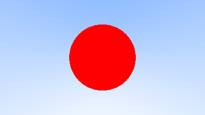
> 4. 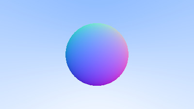
> 5. 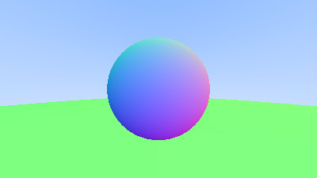
> 6. 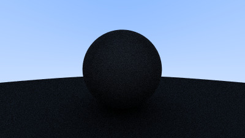
> 7. 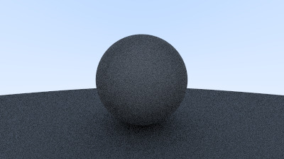
> 8. 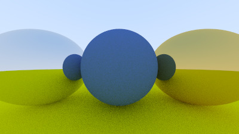
> 9. 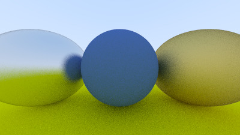
> 10. 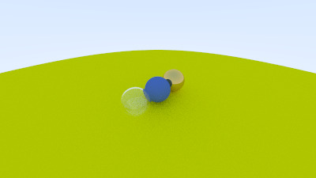
> 11. 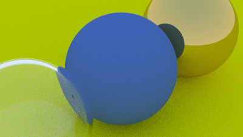
> 12. 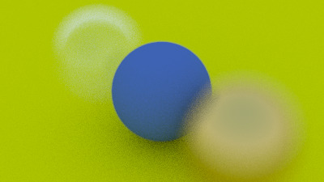
> 13. 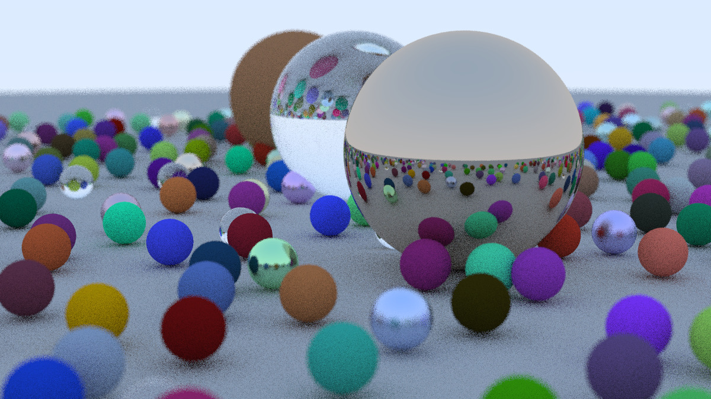

> Steps taken to make our CUDA implementation:
> 1. Creating a cuda header file for our cuda implement -> [header.cuh](HeaderFiles/header.cuh)
> 2. Adding a cuda color header file -> [color.cuh](HeaderFiles/color.cuh)
> 3. Adding a cuda vec3 header file -> [vec3.cuh](HeaderFiles/vec3.cuh)
> 4. Rendering our first image using CUDA -> [firstCuda.cu](firstCuda.cu)
> 5. Adding a cuda ray header file -> [ray.cuh](HeaderFiles/ray.cuh)
> 6. Rendering a gradient image using rays and a simple camera -> [gradient.cu](gradient.cu)
> 7. Introducing a simple sphere -> [simpleSphere.cu](simpleSphere.cu)
> 8. Rendering surface normals on a sphere -> [surfaceNormals.cu](surfaceNormals.cu)
> 9. Adding a cuda sphere header file -> [sphere.cuh](HeaderFiles/sphere.cuh)
> 10. Adding a cuda hittable header file -> [hittable.cuh](HeaderFiles/hittable.cuh)
> 11. Adding a cuda hittable list header file -> [hittableList.cuh](HeaderFiles/hittableList.cuh)
> 12. Rendering a scene with multiple hittable objects -> [multipleSpheres.cu](multipleSpheres.cu)
> 13. Tested ways of allocating hittable objects on the device -> [testAllocation.cu](testAllocation.cu)
> 14. Adding a cuda camera header file -> [camera.cuh](HeaderFiles/camera.cuh)
> 15. Adding random support to get anti-aliasing in cuda -> [multipleSpheresAA.cu](multipleSpheresAA.cu)
> 16. Transforming ray bouncing recursive calls into iterative calls
> 17. Rendering a scene with diffuse materials -> [diffuseSpheres.cu](diffuseSpheres.cu)
> 18. Adding a cuda material header file -> [material.cuh](HeaderFiles/material.cuh)
> 19. Adding material support to our hittable objects
> 20. Adding support for lambertian material -> [material.cuh](HeaderFiles/material.cuh)
> 21. Adding support for metal material -> [material.cuh](HeaderFiles/material.cuh)
> 22. Rendering metal spheres -> [metalSpheres.cu](metalSpheres.cu)
> 23. Adding support for dielectric material -> [material.cuh](HeaderFiles/material.cuh)
> 24. Rendering dielectric spheres -> [dielectricSpheres.cu](dielectricSpheres.cu)
> 25. Adding a cuda camera header file -> [camera.cuh](HeaderFiles/camera.cuh)
> 26. Exploring various camera positions -> [viewpoints.cu](viewpoints.cu)
> 27. Introducing defocus blur -> [depthOfField.cu](depthOfField.cu)
> 28. Rendering our final beautiful scene -> [finalScene.cu](finalScene.cu)
> 29. Finally defeted a Cpp bug worth mentioning
```Cpp
#define SPHERE_COUNT 22*22 + 3 + 1
cudaMalloc((void**)&d_list, SPHERE_COUNT * sizeof(hittable*))
// Results in cuda error: unspecified launch failure ==> SEGFAULT
// Probably because macro is not expanded correctly
// With debug flags on ??
```
> 30. Instrumenting the code and adding some improvements
> 31. Trying to add a source of light in our scene
> 32. Adding support for emissive materials -> [material.cuh](HeaderFiles/material.cuh)

