#### Mitrache Mihnea

# CUDA Implementation for Ray Tracing The Next Week

> Following the steps mentioned below, I ray traced those images :) :
> 1. 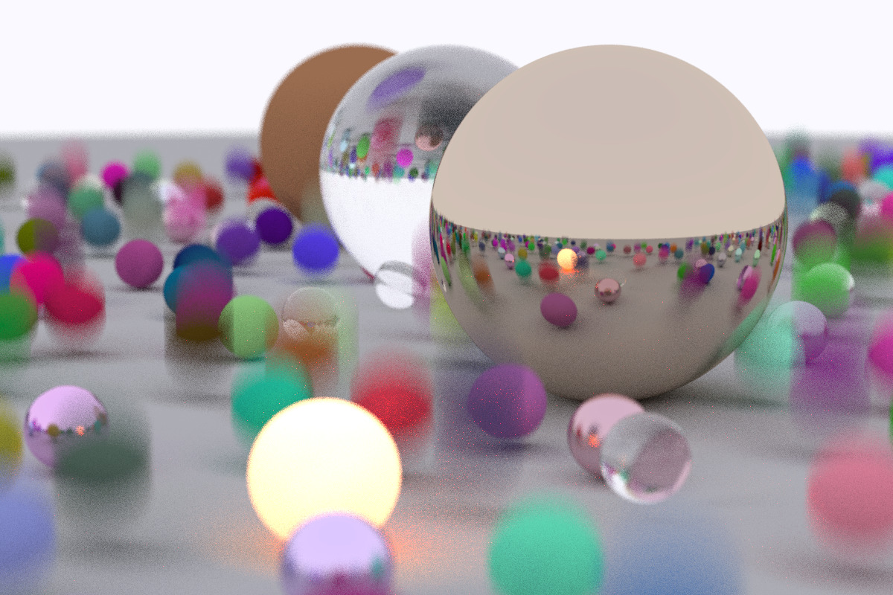
> 2. 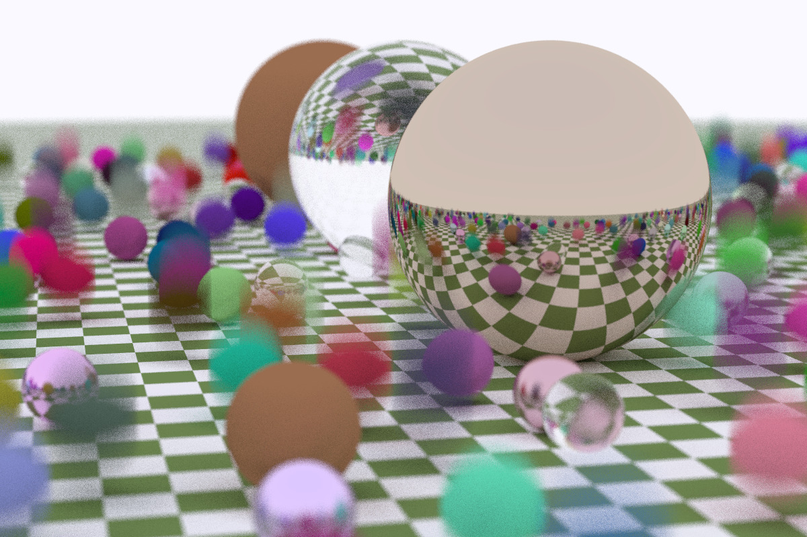
> 3. 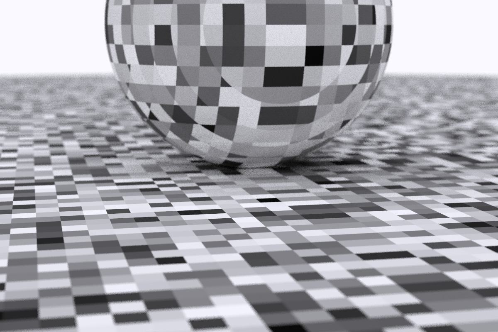
> 4. 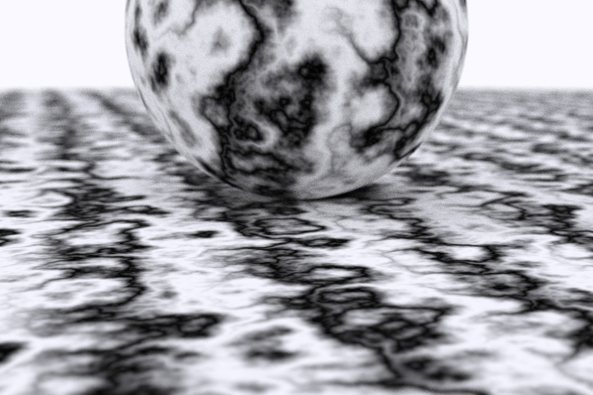
> 5. 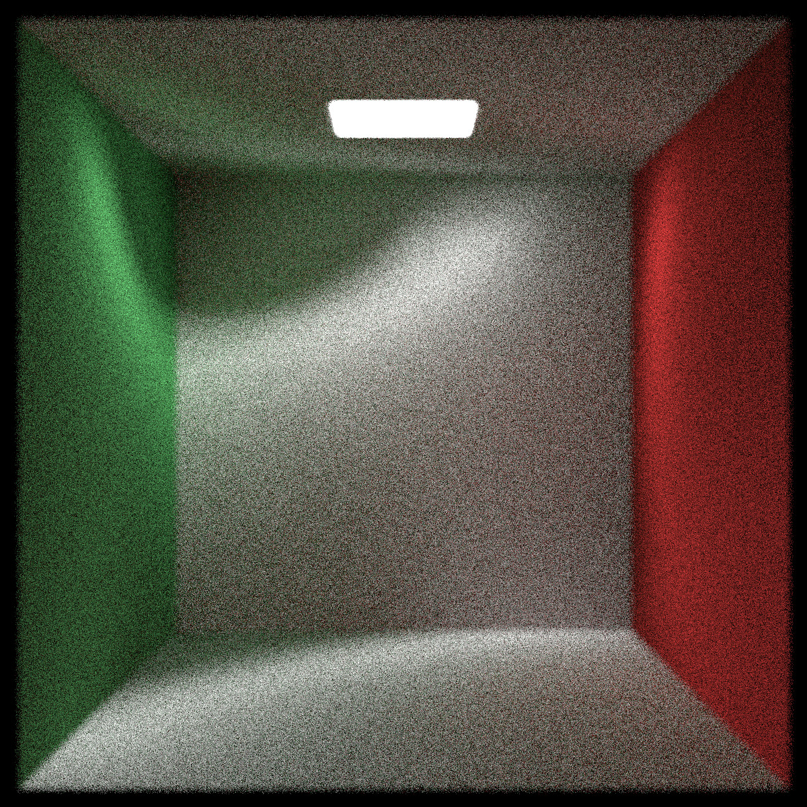
> 6. 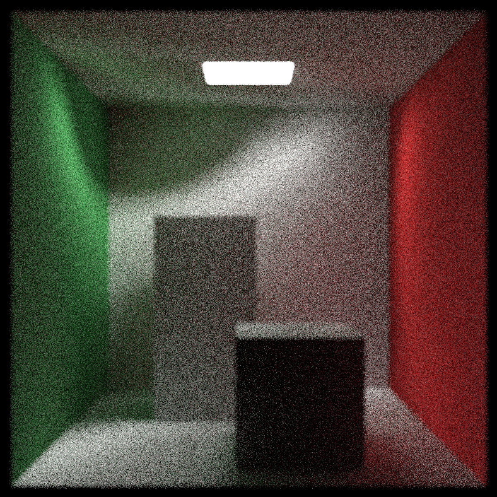
> 7. 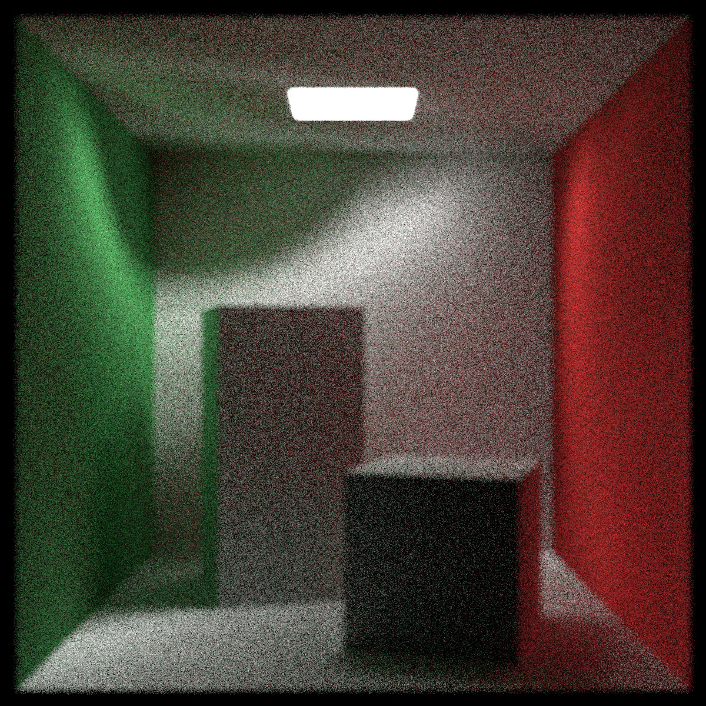
> 8. 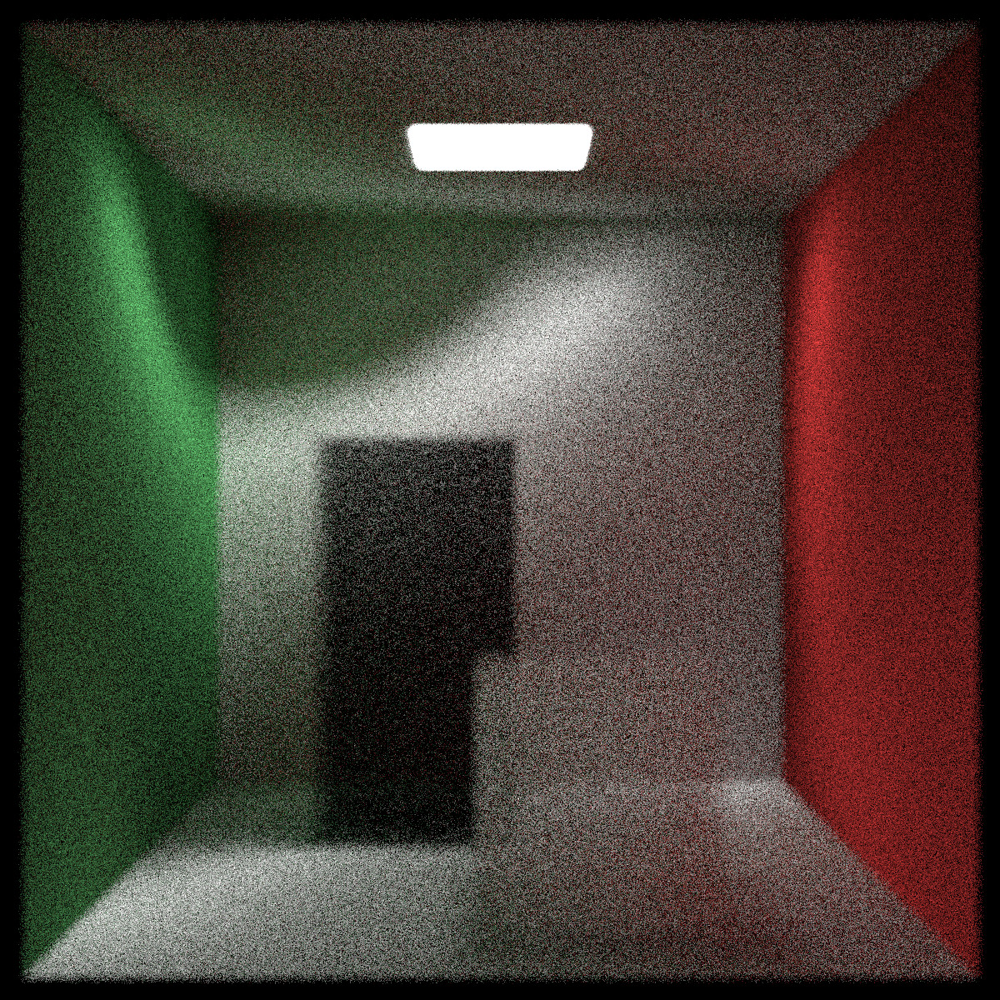
> 9. 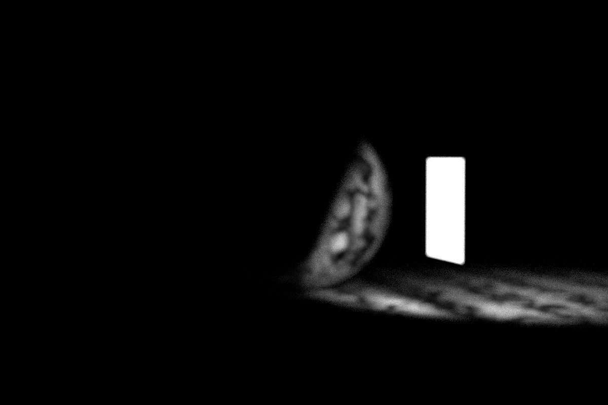
> 10. 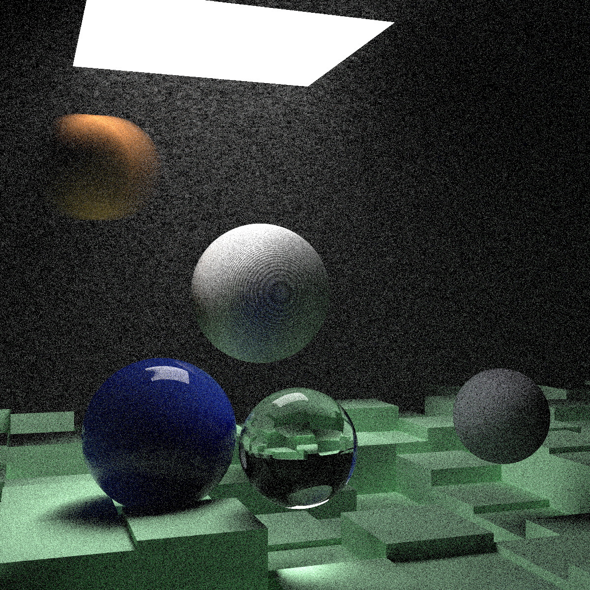
> 11. 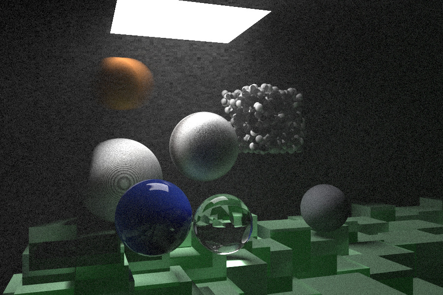
> 12. 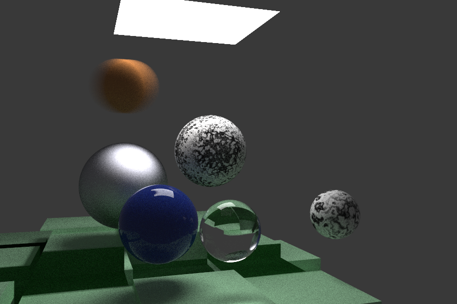
> 13. 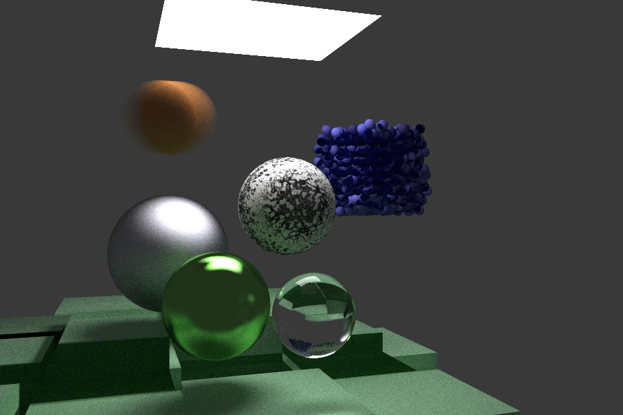

> Steps taken to make our CUDA implementation:
> 1. Starting from CUDA In One Weekend implementation and adding the new functionalities
> 2. Actualizing files to support time stamps in rays
> 3. Rendering previous final scene with motion -> [movingSpheres.cu](SourceFiles/movingSpheres.cu)
> 4. Because of time considerations and casts, spheres which do not move are created as
moving spheres with same position in time
> 5. Adding a AABB cuda header file -> [aabb.cuh](HeaderFiles/aabb.cuh)
> 6. Adding a BVH cuda header file -> [bvh.cuh](HeaderFiles/bvh.cuh)
> 7. Adding a texture class -> [texture.cuh](HeaderFiles/texture.cuh)
> 8. Modelating solid color texture
> 9. Modelating checker texture
> 10. Rendering spheres with checked ground -> [checkerSpheres.cu](SourceFiles/checkerSpheres.cu)
> 11. Adding a perlin noise generator -> [perlin.cuh](HeaderFiles/perlin.cuh)
> 12. Adding a random support cuda header file -> [random.cuh](HeaderFiles/random.cuh)
> 13. Modelating perlin noise texture
> 14. Rendering perlin textured spheres -> [perlinSpheres.cu](SourceFiles/perlinSpheres.cu)
> 15. After a looong time spent on debugging, the perlin noise texture is now looking good. The problem was generated
because the noise texture was dinamically allocated and hence
it resided in global memory of divice but the perlin noise
within the texture class was allocated in local memory of the device. This caused random values to be generated.
> 16. Finalized perlin noise texture to get our beautiful marble texture created on GPU
> 17. Adding a light emitting material -> [material.cuh](HeaderFiles/material.cuh)
> 18. Adding axis aligned rectangles -> [aarect.cuh](HeaderFiles/aarect.cuh)
> 19. Rendering a light emitting rectangle -> [light.cu](SourceFiles/light.cu)
> 20. Since adding the emmisive component to ray color calculation, the step dependency
formula for the ray color is not valid anymore. Instead of having just color attenuation,
we should also accumulate the emmisive component.
> 21. Rendering a Cornell Box with our aarectangles -> [cornellBox.cu](SourceFiles/cornellBox.cu)
> 22. Adding a box cuda header file -> [box.cuh](HeaderFiles/box.cuh)
> 23. Rendering a Cornell Box with interior boxes -> [cornellBoxWithBoxes.cu](SourceFiles/cornellBoxWithBoxes.cu)
> 24. Modelating instance translation -> [translate.cuh](HeaderFiles/translate.cuh)
> 25. Modelating instance rotation -> [rotate_y.cuh](HeaderFiles/rotate_y.cuh)
> 26. Rendering a Cornell Box with transformed boxes -> [cornellBoxWithTransformedBoxes.cu](SourceFiles/cornellBoxWithTransformedBoxes.cu)
> 27. Modelating a constant medium -> [constant_medium.cuh](HeaderFiles/constant_medium.cuh)
> 28. Adding isotropic material support -> [material.cuh](HeaderFiles/material.cuh)
> 29. Rendering a Cornell Box with smoke and fog -> [cornellBoxWithSmoke.cu](SourceFiles/cornellBoxWithSmoke.cu)
> 30. After lots of debugging, the above one still gives
a CUDA error. For now, I will leave it like this.
> 31. Rendering the final scene -> [finalScene.cu](SourceFiles/finalScene.cu)
> 32. After some serious debugging, BVH is integrated in the final scene. :))
> 33. Hopefully, after some improvements, the final scene will be perfect tomorrow.
> 34. Found a bug, if the moving sphere is centered in vec3(0, 0, 0) then we get a
messy image. Probably there is some division by zero somewhere.
> The bug is not present in OneWeekend implementation. This must have
been introduced by me in the CUDA Next Week implementation.
> 35. Found that spheric coordinates were wrongly calculated. Fixed it.