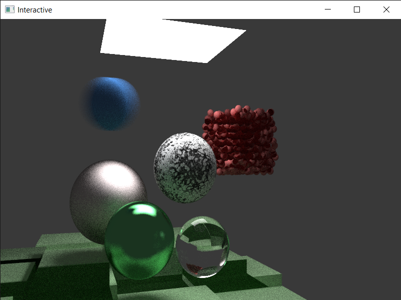

## From a Ray Traced Image to a Ray Traced Scene

### Goal 
Until this point the project ray traced some stunning images. Rendering times
dropped significantly and the quality of the images increased. 
`Now it is time to add some interactivity.`This can be attained with the help of 
`OpenGL` and a `first person camera`. The central idea is to compute the scene using the
CUDA kernel and display the result using OpenGL.

### Structure
* **CMAKE DEPENDENCIES**
    * [CMakeLists.txt](CMakeLists.txt) - The main CMake file
    *  [cmake folder](cmake/)          - Auxiliary CMake find modules
       * [FindGLFW3.cmake](cmmake/FindGLFW3.cmake) - Find GLFW3 header and object file
       * [FindGLM.cmake](cmake/FindGLM.cmake) - Find GLM header
  
* **OPENGL DEPENDENCIES**
    * [include folder](include/) - OpenGL headers
        * [GLFW](include/GLFW/) - Window management
        * [GLAD](include/glad/) & [KHR](include/KHR/) - Extension loader
        * [glm](include/glm/) - Math library
    * [lib folder](lib/) - MVC 2019 precompiled libraries
        * [glfw3.lib](lib/glfw3.lib) - GLFW3 library
    * [thirdparty folder](thirdparty/) - Third party libraries
        * [glad.c](thirdparty/glad.c/) - GLAD source code for runtime needs

* **SOURCE FILES**
    * [src folder](src/) - Source files
        * [headers folder](src/HeaderFiles/)
            * CUDA headers
            * OpenGL/C++ headers
        * [Shaders](src/Shaders) - Shader files
        * [main.cpp](src/main.cpp) - Main file
        * [render.cu](src/render.cu) - CUDA kernel

### Steps
1. **Moving to Visual Studio 2019 and CMake as the main build system** 
For portability reasons, the project uses `CMake` as a build system. This allows
compiling on different platforms. VS 2019 is used as the main IDE for this part of real
time rendering.
Because `compile tools for CUDA and OPENGL/C++ are different`, the project creates
`2 compile paths`. The first one compiles the CUDA kernel and the second one compiles
the C++/OpenGL code. `The final executable is formed by linking the two compiled parts.`
This can be easily done using CMake. 
Also, OPENGL is easier to set up using CMake. I got some inspiration from the [here](https://github.com/tgalaj/OpenGLSampleCmake).

2. **Setting up the OpenGL environment**
The first step is drawing a window in which all the magic will happen. After that, a simple
quad is drawn. The quad will be covered with the ray traced image.

3. **CUDA - OpenGL interop**
Fortunately, CUDA and OpenGL can work together. There is some great API which allows this. It
can be found [here](https://docs.nvidia.com/cuda/cuda-runtime-api/group__CUDART__OPENGL.html) and [here](https://docs.nvidia.com/cuda/cuda-runtime-api/group__CUDART__INTEROP.html#group__CUDART__INTEROP).
The central idea is to link the Quad's OpenGL texture with a CUDA array. There is not substantial
change in the CUDA kernel but the process is not straightforward.
After the execution of the kernel, the textured quad is drawn and gives this result .

4. **First person camera**
In order to make the scene interactive, a first person camera is added. First, 
there is a precomputed camera path. A scene with a complexity of 150 spheres is rendered, at 2 s.p.p. and 800x600 in real time. The result can be seen here .

5. **Denoising**
After the previous example, a problem arised. There is substantial amount of noise when less than 5
pixels are used. A form of denoising should be implemented. 
The first one which comes in mind is frame accumulation. When the camera has a fixed position, the Ray
Tracer accumulates light and final picture is less noisier.